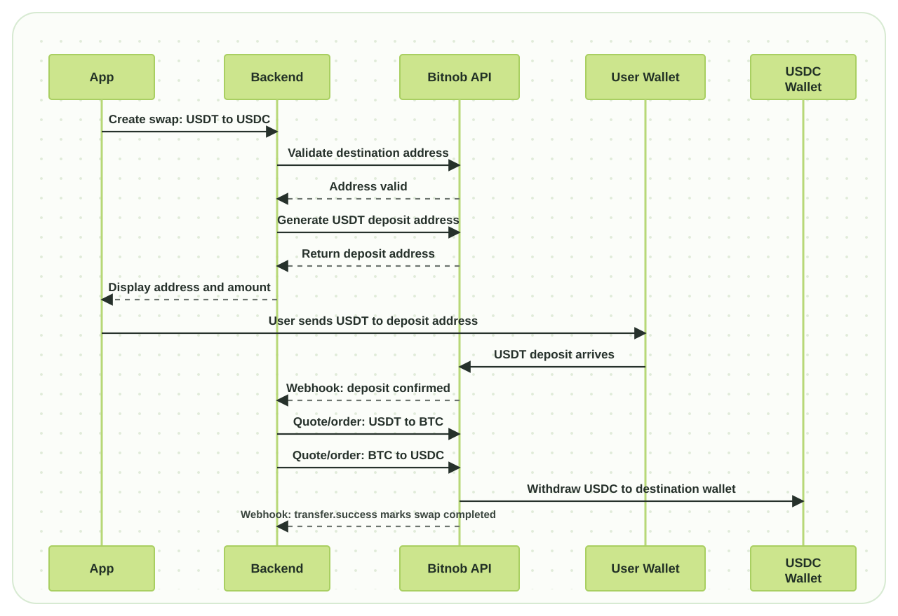

# Tutorial: Accept USDT and Settle as USDC Through BTC

This guide shows how the `cross-chain-swap` backend accepts USDT from a user, routes the value through BTC, and settles the final amount as USDC to the user's destination wallet using Bitnob APIs.

The flow is designed for a cross-chain stablecoin swap product where a user starts with USDT on one supported chain and wants to receive USDC on another supported chain.

---

## Key Concepts

##### The Swap

A swap represents one user conversion session. In this codebase, a swap stores:

- Source chain and asset, for example `tron` and `USDT`
- Destination chain and asset, for example `ethereum` and `USDC`
- User destination address
- Bitnob deposit address
- Trade IDs
- Withdrawal transaction ID
- Current lifecycle status

##### The Deposit Address

After the user creates a swap, the backend asks Bitnob to generate a deposit address for the source chain. This is the address shown to the user so they can send USDT.

##### The BTC Route

When there is no direct USDT to USDC trading route, the backend can use BTC as the bridge asset:

```text
USDT -> BTC -> USDC
```

The service creates a quote and order for each leg, then waits until each order is filled.

##### The Withdrawal

After the final USDC amount is available, the backend calls Bitnob's withdrawal API and sends USDC to the user's destination wallet.

---

## Full Flow Overview



1. The user creates a swap in the app.
2. The backend validates the destination USDC address.
3. The backend generates a Bitnob deposit address for USDT.
4. The app displays the address and amount to the user.
5. The user sends USDT from their wallet.
6. Bitnob sends a deposit webhook to the backend.
7. The backend trades USDT to BTC.
8. The backend trades BTC to USDC.
9. The backend withdraws USDC to the destination wallet.
10. Bitnob sends a transfer success webhook.
11. The backend marks the swap as completed.

---

## Prerequisites

- Bitnob API credentials
- PostgreSQL database
- A reachable webhook URL for Bitnob events
- Supported source and destination chains
- A destination wallet address for the output USDC

The service expects these environment variables:

```bash
BITNOB_CLIENT_ID=your_client_id
BITNOB_CLIENT_SECRET=your_client_secret
DATABASE_URL=postgres://...
BITNOB_WEBHOOK_SECRET=your_webhook_secret
PORT=8080
SWAP_FEE_USDT=2
MIN_SWAP_AMOUNT=10
```

---

## Step 1: Authenticate Bitnob Requests

Every Bitnob API request is signed with HMAC-SHA256. The backend signs the exact JSON payload it sends, using the canonical string:

```text
CLIENT_ID:TIMESTAMP:NONCE:PAYLOAD
```

Code reference: `internal/bitnob/client.go`

```go
func (c *Client) sign(payload string) (map[string]string, error) {
	nonceBytes := make([]byte, 16)
	if _, err := rand.Read(nonceBytes); err != nil {
		return nil, fmt.Errorf("generate nonce: %w", err)
	}

	timestamp := fmt.Sprintf("%d", time.Now().Unix())
	nonce := hex.EncodeToString(nonceBytes)
	message := fmt.Sprintf("%s:%s:%s:%s", c.clientID, timestamp, nonce, payload)

	mac := hmac.New(sha256.New, []byte(c.clientSecret))
	if _, err := mac.Write([]byte(message)); err != nil {
		return nil, fmt.Errorf("sign message: %w", err)
	}

	return map[string]string{
		"X-Auth-Client":    c.clientID,
		"X-Auth-Timestamp": timestamp,
		"X-Auth-Nonce":     nonce,
		"X-Auth-Signature": hex.EncodeToString(mac.Sum(nil)),
	}, nil
}
```

The server verifies credentials on startup by calling Bitnob's `whoami` endpoint.

```go
func (c *Client) Whoami() error {
	var resp any
	if err := c.Do(http.MethodPost, "/api/whoami", nil, &resp); err != nil {
		return err
	}

	encoded, err := json.Marshal(resp)
	if err != nil {
		log.Printf("bitnob whoami response: %+v", resp)
		return nil
	}
	log.Printf("bitnob whoami response: %s", encoded)

	return nil
}
```

---

## Step 2: Create a Swap

The user starts by choosing:

- Source chain, for example `tron`
- Destination chain, for example `ethereum`
- Source asset, for example `USDT`
- Destination asset, for example `USDC`
- Destination wallet address
- Amount to swap

Example request to the app backend:

```json
{
  "from_chain": "tron",
  "to_chain": "ethereum",
  "from_asset": "USDT",
  "to_asset": "USDC",
  "dest_address": "0xUserDestinationAddress",
  "amount_in": 100
}
```

The service normalizes the user input, validates the amount, checks chain and asset support, and requires a destination address.

Code reference: `internal/swap/service.go`

```go
func (s *Service) CreateSwap(fromChain, toChain, fromAsset, toAsset, destAddress string, amountIn float64) (*Swap, error) {
	fromChain = strings.ToLower(strings.TrimSpace(fromChain))
	toChain = strings.ToLower(strings.TrimSpace(toChain))
	fromAsset = strings.ToUpper(strings.TrimSpace(fromAsset))
	toAsset = strings.ToUpper(strings.TrimSpace(toAsset))
	destAddress = strings.TrimSpace(destAddress)

	if amountIn < s.cfg.MinSwapAmount {
		return nil, fmt.Errorf("minimum swap amount is %.2f", s.cfg.MinSwapAmount)
	}
	if _, ok := supportedChains[fromChain]; !ok {
		return nil, fmt.Errorf("unsupported source chain: %s", fromChain)
	}
	if _, ok := supportedChains[toChain]; !ok {
		return nil, fmt.Errorf("unsupported destination chain: %s", toChain)
	}
	if _, ok := supportedAssets[fromAsset]; !ok {
		return nil, fmt.Errorf("unsupported source asset: %s", fromAsset)
	}
	if _, ok := supportedAssets[toAsset]; !ok {
		return nil, fmt.Errorf("unsupported destination asset: %s", toAsset)
	}
}
```

What this means for the user:

- The app should prevent unsupported chain and asset combinations before the user sends funds.
- The app should clearly show the fee and estimated output amount.
- The app should not ask the user to deposit until the backend has created and saved the swap.

---

## Step 3: Validate the Destination Address

Before generating a deposit address, the backend validates the user's destination wallet address with Bitnob.

Code reference: `internal/bitnob/addresses.go`

```go
func (c *Client) ValidateAddress(address, chain string) (bool, error) {
	req := map[string]string{
		"address": address,
		"chain":   chain,
	}

	var resp struct {
		Valid bool `json:"valid"`
	}
	if err := c.Do(http.MethodPost, "/api/addresses/validate", req, &resp); err != nil {
		return false, err
	}

	return resp.Valid, nil
}
```

The swap service stops immediately if the address is invalid.

```go
valid, err := s.bitnob.ValidateAddress(destAddress, toChain)
if err != nil {
	return nil, fmt.Errorf("validate destination address: %w", err)
}
if !valid {
	return nil, errors.New("destination address is invalid for the target chain")
}
```

---

## Step 4: Generate the USDT Deposit Address

After validation, the backend asks Bitnob to generate a deposit address for the source chain.

Code reference: `internal/bitnob/addresses.go`

```go
func (c *Client) GenerateAddress(chain, label, reference string) (*Address, error) {
	req := map[string]string{
		"chain":     chain,
		"label":     label,
		"reference": reference,
	}

	var addr Address
	if err := c.Do(http.MethodPost, "/api/addresses", req, &addr); err != nil {
		return nil, err
	}

	return &addr, nil
}
```

The swap service saves the returned deposit address.

```go
ref := uuid.NewString()
addr, err := s.bitnob.GenerateAddress(fromChain, "swap-"+ref, ref)
if err != nil {
	return nil, fmt.Errorf("generate deposit address: %w", err)
}

sw := &Swap{
	ID:             ref,
	FromChain:      fromChain,
	ToChain:        toChain,
	FromAsset:      fromAsset,
	ToAsset:        toAsset,
	AmountIn:       amountIn,
	AmountOut:      amountOut,
	Fee:            s.cfg.SwapFeeUSDT,
	DepositAddress: addr.Address,
	DestAddress:    destAddress,
	Status:         StatusAwaitingDeposit,
	Reference:      ref,
}
```

What the app should display:

- Deposit address
- Source chain
- Source asset
- Amount to send
- Destination asset
- Estimated amount out
- Status: awaiting deposit

---

## Step 5: Receive the Deposit Webhook

When the user sends USDT to the generated address, Bitnob notifies the backend through a webhook.

Code reference: `internal/webhook/handler.go`

```go
func (h *Handler) Handle(w http.ResponseWriter, r *http.Request) {
	body, err := io.ReadAll(r.Body)
	if err != nil {
		log.Printf("read webhook body: %v", err)
		w.WriteHeader(http.StatusOK)
		return
	}

	if !h.validSignature(r, body) {
		log.Printf("invalid bitnob webhook signature")
		w.WriteHeader(http.StatusOK)
		return
	}

	var evt event
	if err := json.Unmarshal(body, &evt); err != nil {
		log.Printf("decode bitnob webhook: %v", err)
		w.WriteHeader(http.StatusOK)
		return
	}
}
```

For deposit confirmation, the handler looks up the swap using the deposit address and starts trade execution.

```go
func (h *Handler) handleDepositConfirmed(data json.RawMessage) {
	var payload struct {
		Address string `json:"address"`
	}
	if err := json.Unmarshal(data, &payload); err != nil {
		log.Printf("decode deposit webhook data: %v", err)
		return
	}

	sw, err := h.store.GetSwapByDepositAddress(payload.Address)
	if err != nil {
		log.Printf("swap not found for deposit address %s: %v", payload.Address, err)
		return
	}

	go func() {
		if err := h.swapService.ExecuteTrades(sw); err != nil {
			log.Printf("execute trades for swap %s: %v", sw.ID, err)
		}
	}()
}
```

---

## Step 6: Trade USDT to BTC

When the deposit is confirmed, the backend calculates the amount after fees and starts the BTC route.

Code reference: `internal/swap/service.go`

```go
amountAfterFee := sw.AmountIn - sw.Fee
if amountAfterFee <= 0 {
	return errors.New("amount after fee is not positive")
}
```

For the first leg, the backend buys BTC using the source asset.

```go
btcPrice, ok := priceFor(prices, "BTC", sw.FromAsset)
if !ok || btcPrice <= 0 {
	return "", "", "", "", fmt.Errorf("missing BTC/%s price", sw.FromAsset)
}

btcQty := amountAfterFee / btcPrice
trade1Req := bitnob.QuoteRequest{
	BaseCurrency:  "BTC",
	QuoteCurrency: sw.FromAsset,
	Side:          "buy",
	Quantity:      amountToUnits(btcQty, "BTC"),
}
```

The quote is immediately converted into an order.

```go
func (s *Service) quoteAndOrder(req bitnob.QuoteRequest) (*bitnob.Quote, *bitnob.Order, error) {
	var lastErr error
	for attempt := 0; attempt < 2; attempt++ {
		quote, err := s.bitnob.CreateQuote(req)
		if err != nil {
			return nil, nil, err
		}

		order, err := s.bitnob.CreateOrder(bitnob.OrderRequest{
			BaseCurrency:  req.BaseCurrency,
			QuoteCurrency: req.QuoteCurrency,
			Side:          req.Side,
			Quantity:      req.Quantity,
			Price:         quote.Price,
			QuoteID:       quote.ID,
		})
		if err == nil {
			return quote, order, nil
		}
		lastErr = err
		if !looksExpired(err) {
			break
		}
	}

	return nil, nil, lastErr
}
```

---

## Step 7: Trade BTC to USDC

After the BTC buy order is filled, the backend sells BTC for the destination asset.

```go
btcAmount := trade1Quote.Exchange.ReceiveQuantity
trade2Req := bitnob.QuoteRequest{
	BaseCurrency:  "BTC",
	QuoteCurrency: sw.ToAsset,
	Side:          "sell",
	Quantity:      btcAmount,
}
trade2Quote, trade2Order, err := s.quoteAndOrder(trade2Req)
if err != nil {
	return "", "", "", "", fmt.Errorf("execute BTC sell: %w", err)
}
```

The service polls Bitnob until each order reaches a terminal state.

```go
func (s *Service) pollFilled(orderID string) error {
	deadline := time.Now().Add(2 * time.Minute)
	for time.Now().Before(deadline) {
		order, err := s.bitnob.GetOrder(orderID)
		if err != nil {
			return err
		}

		switch strings.ToLower(order.Status) {
		case "filled", "completed", "success", "successful":
			return nil
		case "failed", "cancelled", "canceled", "rejected":
			return fmt.Errorf("order %s ended with status %s", orderID, order.Status)
		}

		time.Sleep(2 * time.Second)
	}

	return fmt.Errorf("order %s was not filled before timeout", orderID)
}
```

---

## Step 8: Withdraw USDC to the User

After the final trade is filled, the backend withdraws the received USDC amount to the user's destination address.

Code reference: `internal/swap/service.go`

```go
func (s *Service) withdraw(sw *Swap, amount string) error {
	if err := s.store.UpdateSwapStatus(sw.ID, StatusSending); err != nil {
		return fmt.Errorf("mark sending: %w", err)
	}

	withdrawal, err := s.bitnob.Withdraw(bitnob.WithdrawalRequest{
		ToAddress:   sw.DestAddress,
		Amount:      amount,
		Currency:    sw.ToAsset,
		Chain:       sw.ToChain,
		Reference:   sw.ID + "-withdrawal",
		Description: "Cross-chain stablecoin swap",
	})
	if err != nil {
		return fmt.Errorf("withdraw output asset: %w", err)
	}

	if withdrawal.TransactionID != "" {
		if err := s.store.SetWithdrawalTxID(sw.ID, withdrawal.TransactionID); err != nil {
			return fmt.Errorf("save withdrawal tx id: %w", err)
		}
	}

	return nil
}
```

Code reference: `internal/bitnob/withdrawal.go`

```go
func (c *Client) Withdraw(req WithdrawalRequest) (*Withdrawal, error) {
	var withdrawal Withdrawal
	if err := c.Do(http.MethodPost, "/api/withdrawal", req, &withdrawal); err != nil {
		return nil, err
	}

	return &withdrawal, nil
}
```

---

## Step 9: Mark the Swap Completed

When Bitnob sends a transfer success webhook, the backend resolves the original swap reference and marks the swap as completed.

```go
func (h *Handler) handleTransferSuccess(data json.RawMessage) {
	var payload struct {
		Reference string `json:"reference"`
	}
	if err := json.Unmarshal(data, &payload); err != nil {
		log.Printf("decode transfer webhook data: %v", err)
		return
	}
	if payload.Reference == "" {
		log.Printf("transfer webhook missing reference")
		return
	}

	ref := strings.TrimSuffix(payload.Reference, "-withdrawal")
	sw, err := h.store.GetSwapByReference(ref)
	if err != nil {
		log.Printf("swap not found for withdrawal reference %s: %v", payload.Reference, err)
		return
	}
	if err := h.store.UpdateSwapStatus(sw.ID, swap.StatusCompleted); err != nil {
		log.Printf("mark swap %s completed: %v", sw.ID, err)
	}
}
```

At this point, the user can see that the USDC transfer has completed.

---

## User Experience Checklist

The user should see clear status updates at each stage:

- `awaiting_deposit`: show deposit address and amount
- `deposit_confirmed`: tell the user the deposit was received
- `trade_1_done`: USDT has been converted to BTC
- `trade_2_done`: BTC has been converted to USDC
- `sending`: USDC withdrawal is in progress
- `completed`: USDC has been sent successfully
- `failed`: show a support-friendly failure message

The app should also show:

- The source chain and destination chain
- The source asset and destination asset
- The fee
- Estimated amount out
- Swap reference
- Withdrawal transaction ID when available

---

## Handling Errors

##### Invalid Destination Address

If Bitnob rejects the destination address, the backend returns:

```text
destination address is invalid for the target chain
```

The user should be asked to enter a valid address for the selected destination chain.

##### Missing BTC Price

If the service cannot find the BTC price for the source or destination asset, it fails before trading.

```go
return "", "", "", "", fmt.Errorf("missing BTC/%s price", sw.FromAsset)
```

##### Expired Quote

The backend retries quote execution once if the failure looks like an expired quote.

```go
func looksExpired(err error) bool {
	message := strings.ToLower(err.Error())
	return strings.Contains(message, "expired") || strings.Contains(message, "quote")
}
```

##### Failed Order

If Bitnob returns a failed, cancelled, or rejected order status, the swap is marked as failed.

```go
case "failed", "cancelled", "canceled", "rejected":
	return fmt.Errorf("order %s ended with status %s", orderID, order.Status)
```

---

## Best Practices

- Use a unique reference for every swap.
- Store every Bitnob ID returned during quote, order, address, and withdrawal steps.
- Always validate the destination address before accepting a deposit.
- Show the exact chain and asset the user must send.
- Do not mark a swap completed until the transfer success webhook arrives.
- Keep webhook verification enabled in production.
- Log the swap reference in every lifecycle event for reconciliation.
- Treat quote expiry as normal behavior and retry safely.

---

## Summary

This flow lets the app accept USDT from a user, convert the value through BTC, and deliver USDC to a destination wallet.

The backend owns the orchestration:

```text
Create swap -> Generate deposit address -> Receive webhook -> Trade USDT to BTC -> Trade BTC to USDC -> Withdraw USDC -> Complete swap
```

This makes it possible to build a user-facing cross-chain stablecoin swap experience while keeping the Bitnob API logic inside the backend.
